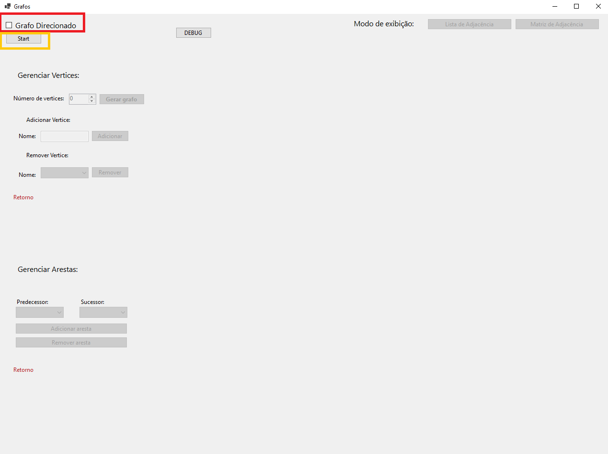
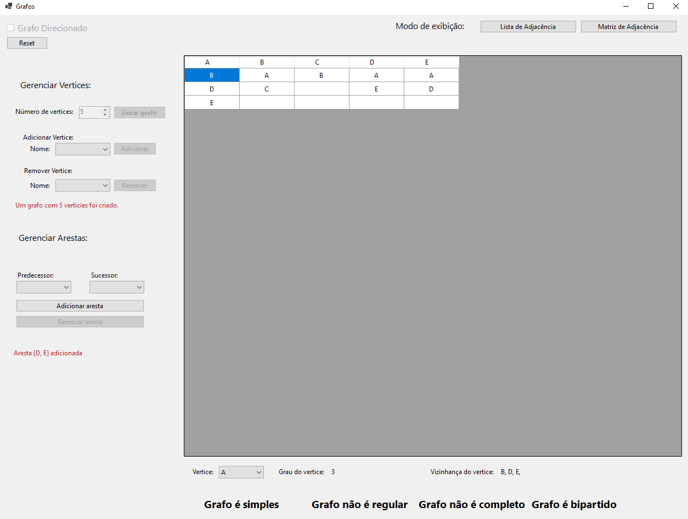

# Trabalho de Algoritmos em Grafos

Trabalho desenvolvido para a disciplina de Algoritmos em Grafos, ministrada pelo professor Walison, no curso de Engenharia da Computação da Pontifícia Universidade Católica de Minas Gerais (PUC Minas).

## Alunos:
 - Alberto Magno
 - Bruno Guimarães Bitencourt
 - Oscar Dias 


### Índice

1. [Objetivos](#objetivos)
	1. [Descrição](#descricao)
	1. [Pré-requisitos](#pre-requisitos)
1. [Instalação e Execução](#instalacao-e-execucao)
1. [Utilização Básica](#utilizacao-basica)
1. [Implementação](#implementacao)
	1. [Classe Vertex.cs](#classe-vertex)
	1. [Classe Edge.cs](#classe-edge)
	1. [Classe Graph.cs](#classe-graph) 
1. [Exemplo de Utilização](#exemplo-de-utilizacao)
	1. [Grafo Não Direcionado](#exemplo-grafo-direcionado) 
	1. [Grafo Direcionado](#exemplo-grafo-direcionado)
1. [Conclusão](#conclusao)


# Objetivos
<a name="#objetivos"></a>

## Descrição
<a name="#descricao"></a>
O trabalho consiste na implementação de uma aplicação que realiza manipulações em grafos utilizando a linguagem C#.

## Pré-requisitos
<a name="#pre-requisitos"></a>
- Representação do grafo utilizando matriz de adjacência.
- Representação do grafo utilizando lista de adjacência.
- Criação de um grafo com um número variável de vértices (o número de vértices deve ser inserido pelo usuário).
- Possibilidade de definir se o grafo é direcionado ou não.
- Implementação das operações de criação e remoção de arestas.
- Identificação da vizinhança de um vértice (grafo não direcionado) ou sucessores e predecessores (grafo direcionado)
- Identificação do grau de um vértice
- Verificação das propriedades de ser um grafo simples, regular, completo e bipartido.

# Instalação e Execução
<a name="#instalacao-e-execucao"></a>
Para executar o programa é necessário clonar o repositório através do comando:
```bash
git clone https://github.com/Magno-Al/GraphManipulatorProject.git
```

Após clonar o repositório, abra a pasta `bin` do projeto conforme mostrado na figura abaixo:

<p align="center">
  
</p>

Em seguida, entre no diretório 'Release/net6.0-windows' e execute o arquivo 'GraphManipulator.exe' conforme mostrado abaixo:

<p align="center">
  
</p>

Dessa forma o programa será executado.
 <p align="center">
  
</p>

# Utilização Básica
<a name="#utilizacao-basica"></a>

O primeiro passo para utilização do sistema é selecionar a opção se deseja criar um grafo direcionado ou não (quadro em vermelho). E apartir disso clicar no botão "Start" (quadro em amarelo).
 <p align="center">
  
</p>

A partir disso, o sistema irá habilitar a opção de inserir o número de vértices, conforme mostrado abaixo:
 <p align="center">
  
</p>

Após gerar o grafo, sistema habilitará as opções de Adicionar ou Remover Areastas, além de habilitar os combos na área de Gerenciar Arestas. Além disso, é possível a visualização do grafo clicando no botão **Lista de Adjacência** ou **Matriz de Adjacência**
 <p align="center">
  
 </p>

Na parte inferior da tela, é possível a partir de um seletor verifar as informações de grau do vértice e vizinhança do vértice. No caso de um grafo direcionado, os parâmetros grau do vértice de entrada, grau do vérice de saída, predecessores e sucessores irão aparecer. Além disso, informações se o grafo é simples, regular completo e bipartido.
<p align="center">
  
</p>

# Implementação
<a name="#implementacao"></a>
A principal classe do projeto é a classe 'Graph.cs', que é responsável por manipular o grafo. Ela é baseada na implementação de outras duas classes: 'Vertex' e 'Edges'.

## Classe `Vertex`
<a name="#classe-vertex"></a>
A classe Vetex é responsável por representar um vértice do grafo. Ela possui os seguintes atributos:
```csharp
// Atributos da Classe Vertex
public string Name { get; set; } // Nome do vértice
public bool? ColorMark { get; set; } // Marcação de cor
```


## Classe 'Edge'
<a name="#classe-edge"></a>
A classe Edge é responsável por representar uma aresta do grafo. Ela possui os seguintes atributos:
```csharp
// Atributos da Classe Edge
public string Name { get; set; } // Nome da aresta
public Vertex Predecessor { get; set; } // Vértice de origem
public Vertex Successor { get; set; } // Vértice de destino
```


### Classe `Graph`
<a name="#classe-graph"></a>
A classe Graph é responsável por manipular o grafo. Ela possui os seguintes atributos:
```csharp
public bool IsDirectGraph { get; set; }// Indica se o grafo é direcionado ou não
private List<Vertex> Vertices { get; set; }// Lista de vértices do grafo
private List<Edge> Edges { get; set; }// Lista de arestas do grafo
public Dictionary<string, List<string>> AdjacencyList { get; private set; } // Lista de adjacência que mapeia cada vértice para seus vértices adjacentes
public int[,] AdjacencyMatrix { get; private set; }// Matriz de adjacência que representa as conexões entre os vértices
```

# Exemplo de Utilização
<a name="#exemplo-de-utilizacao"></a>
A seguir, serão apresentados exemplos de utilização do sistema considerando os casos de um grafo não direcionado e direcionado.

## Grafo Não Direcionado
<a name="#exemplo-grafo-nao-direcionado"></a>
Para exemplificar o uso do sistema, será criado um grafo não direcionado mostrado na figura abaixo:
<p align="center">
  
</p>

A figura abaixo mostra a visualização do grafo através de uma lista de adjacência.
<p align="center">
  
</p>

>[!IMPORTANT]
>
> Para visualização da lista de adjacência na tabela é preciso se orientar pelas colunas. No exemplo o vértice A tem uma lista de adjacência cujos elementos são B, D e E.

A figura abaixo mostra a visualização do grafo através de uma matriz de adjacência.
<p align="center">
  
</p>


## Grafo Direcionado
<a name="#exemplo-grafo-direcionado"></a>
Para exemplificar o uso do sistema, será criado um grafo direcionado mostrado na figura abaixo:
<p align="center">
  
</p>

A figura abaixo mostra a visualização do grafo através de uma lista de adjacência.
<p align="center">
  
</p>

A figura abaixo mostra a visualização do grafo através de uma matriz de adjacência.
<p align="center">
  
</p>

#Conclusão
<a name="#conclusao"></a>
O trabalho foi desenvolvido com sucesso, atendendo aos requisitos propostos. O sistema é capaz de manipular grafos direcionados e não direcionados, além de realizar operações como adicionar e remover arestas, verificar a vizinhança de um vértice, o grau de um vértice e as propriedades de ser um grafo simples, regular, completo e bipartido. O sistema foi desenvolvido em C# e utiliza a interface gráfica do Windows Forms.


